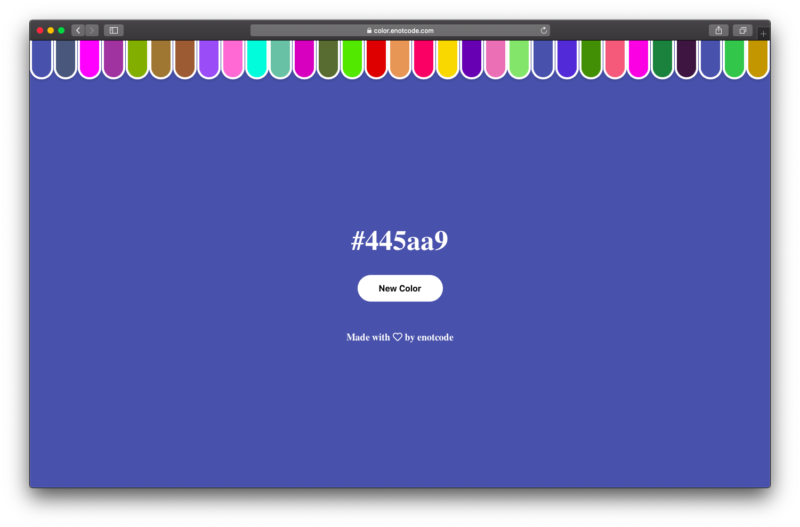

# Color

[color.enotcode.com](https://color.enotcode.com/)

# Local launch

1. Clone repo: `https://github.com/enotcode/color.git`
2. Run `cd color`
3. Run `yarn install`
4. Run `yarn serve` for live-preview
5. Go to `localhost:8080`

# License

[MIT](LICENSE)
